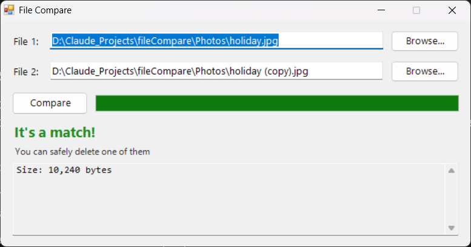

# FileCompare

A stupidly simple Windows app that tells you whether two files are exactly the same using SHA256. portable and stupidly small.

> ⚠️ **Warning! Every line in this app is 100% Vibecoded by Claude opus 5.5 Low!!!** ⚠️
>
> It works on my machine, so i hope it works on yours. But hey, at least it is free and no ads appear every time you use it.



## Download

**[⬇️ Download FileCompare.exe](https://github.com/liangforstudy/fileCompare/raw/main/FileCompare.exe)** (~10 KB, no install needed)

> Windows may show a "Windows protected your PC" warning because the exe isn't signed. Click **More info** → **Run anyway**.

## Features

- **Drag 2 files onto `FileCompare.exe`** and it compares them right away.
- **Drag 1 file onto it, or double-click it,** to open a window. Then add the 2nd file by dropping it on the window or clicking **Browse...**.
- Shows a progress bar, which helps with big files.
- Results:
  - ✅ **It's a match!**: the files are identical. It also shows the file size.
  - ❌ **False (sizes differ / contents differ)**: it shows each file's size and SHA256 hash.
- Portable: one ~10 KB exe with no installer, no registry changes and no super scarry black console window that looks like you got hacked.

## Requirements

- Windows 10 or 11. The .NET Framework 4.x it needs is built into Windows.

## Building

The C# compiler is included with Windows, so you don't need to install anything:

```
C:\Windows\Microsoft.NET\Framework64\v4.0.30319\csc.exe /nologo /target:winexe /optimize /out:FileCompare.exe FileCompare.cs
```

## Contributors

- [liangforstudy](https://github.com/liangforstudy): idea and testing
- **Claude** (Anthropic): all of the code
